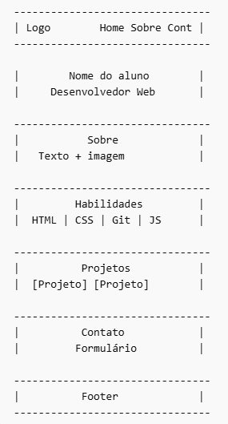

# 🎯 Desafio Final — Criando seu Portfólio

Chegou a hora de colocar tudo em prática!

Neste desafio final, você irá desenvolver um **portfólio pessoal**
utilizando os conhecimentos adquiridos durante a capacitação.

Este projeto será uma oportunidade para demonstrar:

- Estrutura HTML correta
- Estilização com CSS
- Layout moderno
- Responsividade
- Organização do código
- Boas práticas com Git e GitHub

---

# 🧩 Objetivo do desafio

Criar um **site de portfólio pessoal**, apresentando:

- Quem você é
- Suas habilidades
- Seus projetos
- Um formulário de contato

Seu portfólio deve ser **responsivo** e seguir as boas práticas
ensinadas durante a capacitação.

---

# 🧱 Estrutura esperada

Seu portfólio deve conter as seguintes seções:

- Header
- Banner
- Sobre
- Habilidades
- Projetos
- Contato
- Footer

### Estrutura visual sugerida:


---

# ⚙️ Requisitos obrigatórios

Seu projeto **deve conter**:

- ✅ Header utilizando **Flexbox**
- ✅ Seção de **Projetos utilizando Grid**
- ✅ HTML Semântico
- ✅ Layout **Mobile First**
- ✅ Responsividade
- ✅ Formulário funcional (HTML)
- ✅ Uso correto de tags HTML
- ✅ Organização do CSS
- ✅ Boas práticas Git

---

# ⭐ Requisitos opcionais (diferencial)

Estes itens **não são obrigatórios**, porém **valem destaque**:

- ⭐ Uso de **variáveis CSS**

Exemplo:

```css
:root {
  --cor-primaria: #3742fa;
  --cor-secundaria: #2f3542;
}
```

- ⭐ Uso de ícones
- ⭐ Efeitos hover
- ⭐ Layout moderno
- ⭐ Animações simples

---

# 📱 Responsividade obrigatória

Seu site deve funcionar bem em:

- 📱 Celular
- 📲 Tablet
- 🖥️ Desktop

Utilize a abordagem **Mobile First**: `@media (min-width)`

---

# 🎨 Escolhendo cores (Paletas)

Escolher uma boa paleta de cores é essencial.

Você pode usar os seguintes sites:

### Geradores de Paletas
- [Coolors](https://coolors.co/)
- [Color Hunt](https://coolors.co/)
- [Adobe Colors](https://color.adobe.com/pt/)
- [Paletton](https://paletton.com/#uid=1000u0kllllaFw0g0qFqFg0w0aF)
- [Huemint](https://huemint.com/)

### Sugestões de Peletas

🔵 Paleta Azul Moderna:
```css
#1e3a8a
#3b82f6
#60a5fa
#dbeafe
#0f172a
```

🟣 Paleta Roxa Profissional:
```css
#4c1d95
#7c3aed
#a78bfa
#ede9fe
#1e1b4b
```

🌿 Paleta Verde Tech:
```css
#064e3b
#059669
#10b981
#d1fae5
#022c22
```

---

# 🔤 Escolhendo fontes

Fontes fazem muita diferença no visual.

### 🔎 Sites para buscar fontes

- [Google Fonts](https://fonts.google.com/)
- [Fonts Share](https://fontshare.com/)
- [Dafont](https://www.dafont.com/pt/)

### ⭐ Fontes recomendadas

Modernas e Profissionais:
- Poppins
- Inter
- Montserrat
- Roboto

Para títulos:
- Bebas Neue
- Oswald

Exemplo de uso de fonte:
```html
<link href="https://fonts.googleapis.com/css2?family=Poppins&display=swap" rel="stylesheet">
```

---

# 🧰 Ferramentas úteis
Essas ferramentas podem ajudar muito no desenvolvimento.

### 🎨 Design

- Figma
- Canva

### 🖼️ Imagens gratuitas

- [Unsplash](https://unsplash.com)
- [Pexels](https://pexels.com)
- [Pixabay](https://pixabay.com)

### 🔤 Ícones

- [FontAwesome](https://fontawesome.com)
- [Hero Icons](https://heroicons.com)
- [Icons8](https://icons8.com)

### 🖼️ Banner

Você deverá criar um banner contendo:

- Seu nome
- Seu título
- Uma frase opcional
- Um fundo visual

Exemplo:

```html
João Silva  
Desenvolvedor Web  
"Transformando ideias em código"
```

---

# 🔎 Sites para inspiração

- [Dribble](https://dribbble.com)
- [Behance](https://behance.net)

---

# 📂 Estrutura sugerida do projeto

```
portfolio/
│
├── index.html
│
├── css/
├──── style.css
├──── responsive.css
│
├── imagens/
│
└── README.md
```

---

# 🧪 Testes obrigatórios

Antes de entregar, verifique:

- ✅ Testar no celular
- ✅ Testar no desktop
- ✅ Verificar responsividade
- ✅ Verificar layout quebrado
- ✅ Verificar alinhamentos

---

# 🔀 Boas práticas Git obrigatórias

Você deve:

- ✅ Criar commits claros
- ✅ Utilizar mensagens descritivas
- ✅ Fazer Pull Request
- ✅ Organizar o código

Exemplos de commits:

```
feat: adiciona seção sobre
style: cria layout responsivo
fix: corrige alinhamento do header
```

---

# 🏆 Critérios de avaliação

Seu projeto será avaliado com base em:

- Estrutura HTML
- Uso correto de CSS
- Responsividade
- Organização do código
- Criatividade
- Layout visual
- Uso correto de Flexbox
- Uso correto de Grid

---

# 🚀 Dicas finais

- ✔ Comece pelo mobile
- ✔ Faça pequenas etapas
- ✔ Teste sempre
- ✔ Organize o código
- ✔ Não copie — entenda

---

# 🎯 Objetivo final

Criar um portfólio que você possa usar futuramente
como base para sua carreira.

Este pode ser o primeiro site do seu portfólio real.

💻🚀 Capriche!